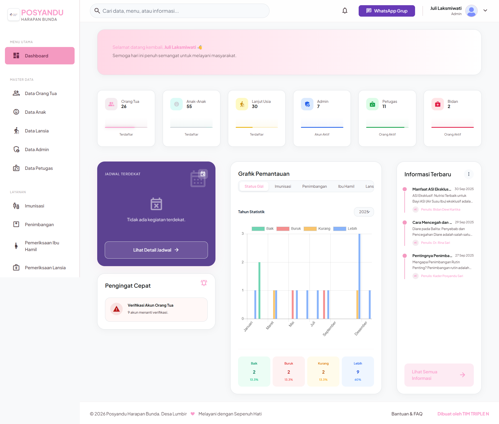
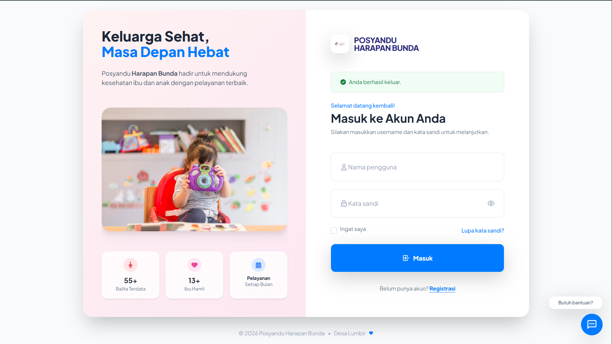

# Posyandu Harapan Bunda - E-Health Information System

Website Sistem Informasi Posyandu Harapan Bunda yang dikembangkan sebagai proyek mata kuliah **Informatika Medik** di Program Studi Informatika, Universitas Jenderal Soedirman.

Aplikasi ini dirancang untuk mendukung digitalisasi layanan Posyandu melalui pengelolaan data pasien, rekam medis, inventaris obat dan vaksin, serta penyediaan informasi dan edukasi kesehatan bagi masyarakat.




---

## Tentang Project

Sebelum sistem ini dikembangkan, proses pencatatan di Posyandu Harapan Bunda masih dilakukan secara manual sehingga pengelolaan data pasien dan layanan kesehatan menjadi kurang efisien. Website ini dibangun untuk membantu digitalisasi proses administrasi serta menyediakan media informasi yang dapat diakses oleh masyarakat.

Tujuan utama pengembangan sistem meliputi:

- Digitalisasi data pasien dan layanan kesehatan.
- Mempermudah pengelolaan administrasi Posyandu.
- Menyediakan informasi jadwal kegiatan secara terpusat.
- Menyediakan media edukasi kesehatan berbasis web.

---

## Fitur Utama

### Autentikasi & Manajemen Akun
- Registrasi pengguna & login multi-role.
- Pembatasan hak akses berdasarkan peran pengguna (Administrator, Bidan, Kader/Petugas, dan Orang Tua/Masyarakat).

### Dashboard
- Ringkasan data pasien dan petugas secara real-time.
- Kalender jadwal kegiatan Posyandu terdekat.
- Statistik layanan interaktif (Status Gizi, Imunisasi, Penimbangan, Pemeriksaan Ibu Hamil & Lansia).

### Manajemen Data Master
- Pengelolaan data Orang Tua, Anak (Balita), Ibu Hamil, Lansia, dan Petugas.

### Layanan Kesehatan (Pencatatan & Rekam Medis)
- Pemeriksaan Ibu Hamil & Lansia.
- Pencatatan Imunisasi & Penimbangan Balita.
- Riwayat pemeriksaan pasien yang tersimpan secara terpusat.
- Cetak laporan hasil pelayanan kesehatan.

### Persediaan (Inventory)
- Manajemen stok vaksin dan obat.
- Monitoring tanggal kedaluwarsa persediaan.
- Log riwayat penggunaan obat/vaksin.

### Edukasi & Pusat Bantuan
- Media artikel edukasi kesehatan posyandu.
- Integrasi chat bantuan WhatsApp & QR Code grup.

---

## Implementasi Teknis & Teknologi

| Komponen | Teknologi |
|----------|-----------|
| **Backend Framework** | Laravel 12 (PHP ^8.2) |
| **Database** | MySQL / MariaDB (Development menggunakan SQLite) |
| **ORM** | Eloquent ORM |
| **Frontend Utilities** | Blade Templates, HTML5, JavaScript (AJAX, jQuery) |
| **UI Framework** | Tailwind CSS (Auth & Dashboard Utama) & Bootstrap / Stisla (Halaman Data & Formulir) |
| **Libraries** | Chart.js (Visualisasi Statistik), SweetAlert (Notifikasi Konfirmasi) |
| **Architecture** | Model-View-Controller (MVC) |

---

## Struktur Project

```text
app/
  ├── Http/
  │    ├── Controllers/ (Logika Pengendali)
  │    └── Middleware/  (Autentikasi & Pembatasan Role)
  └── Models/           (Eloquent Models & Hubungan Database)
config/                 (Konfigurasi Laravel)
database/
  ├── migrations/       (Rancangan Skema Database)
  └── seeders/          (Data Contoh Awal)
public/
  ├── img/              (Aset Gambar & Logo)
  └── screenshotweb/    (Tangkapan Layar Web)
resources/
  └── views/            (Tampilan Halaman Blade/HTML)
routes/
  └── web.php           (Rute Web & API AJAX)
```

---

## Menjalankan Project (Local)

Clone repository:
```bash
git clone https://github.com/finadio/PosyanduHarapanBunda.git
cd PosyanduHarapanBunda
```

Salin berkas environment dan atur konfigurasi database pada `.env`:
```bash
copy .env.example .env
```

Install dependensi backend (Composer):
```bash
composer install
```

Generate application key:
```bash
php artisan key:generate
```

Jalankan migrasi database beserta data seeder:
```bash
php artisan migrate --seed
```

Jalankan server lokal Laravel:
```bash
php artisan serve
```
Akses melalui browser di: `http://127.0.0.1:8000`

---

## Tautan & Demo

- **Website Demo:** [posyanduhb.free.nf](https://posyanduhb.free.nf/)
- **GitHub Repository:** [github.com/finadio/PosyanduHarapanBunda](https://github.com/finadio/PosyanduHarapanBunda)

---

## Pengembang

**Fina Julianti**  
Program Studi Informatika  
Universitas Jenderal Soedirman  

* **Mata Kuliah:** Informatika Medik  
* **Dosen Pengampu:** Dwi Kurnia Wibowo, S.Kom., M.Kom.
